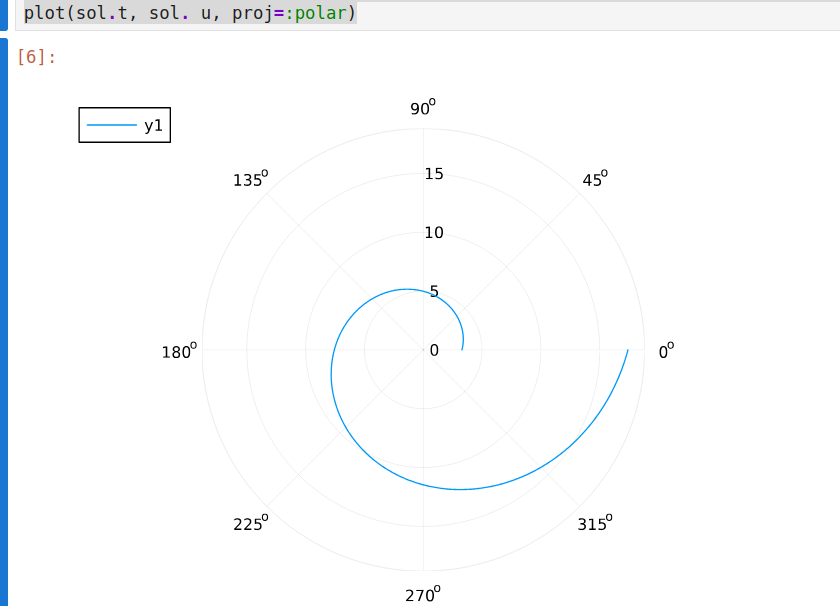
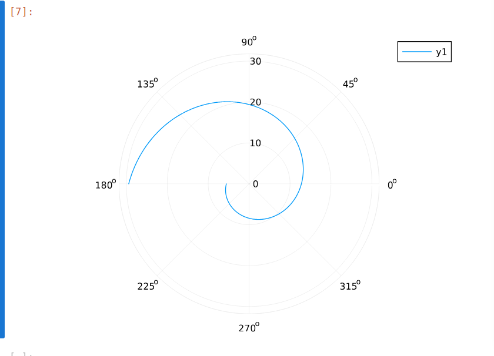

---
## Front matter
lang: ru-RU
title: Лабораторная работа №2
subtitle: Задача о погоне
author:
  - Акопян Сатеник
institute:
  - Российский университет дружбы народов, Москва, Россия
  # - Объединённый институт ядерных исследований, Дубна, Россия
# date: 01 января 1970

## i18n babel
babel-lang: russian
babel-otherlangs: english

## Formatting pdf
toc: false
toc-title: Содержание
slide_level: 2
aspectratio: 169
section-titles: true
theme: metropolis
header-includes:
 - \metroset{progressbar=frametitle,sectionpage=progressbar,numbering=fraction}
---

## Задание

(1132226451%70) + 1 = 42 вариант

На море в тумане катер береговой охраны преследует лодку браконьеров.
Через определенный промежуток времени туман рассеивается, и лодка
обнаруживается на расстоянии 16,1 км от катера. Затем лодка снова скрывается в
тумане и уходит прямолинейно в неизвестном направлении. Известно, что скорость
катера в 3,9 раза больше скорости браконьерской лодки.

## Выполнение лабораторной работы

Запишем уравнение описывающее движение катера, с начальными условиями для двух случаев.

Принимает за $t_0 = 0$ , $x_{л0} = 0$ - место нахождения лодки браконьеров в
момент обнаружения,$x_{k0} = 16.1$ - место нахождения катера береговой охраны
относительно лодки браконьеров в момент обнаружения лодки.

## Выполнение лабораторной работы

Введем полярные координаты. Считаем, что полюс - это точка обнаружения
лодки браконьеров $$x_{л0} ( {\theta }= x_{л0} = 0)$$ а полярная ось $r$ проходит через точку нахождения катера береговой охраны

Траектория катера должна быть такой, чтобы и катер, и лодка все время
были на одном расстоянии от полюса $\theta$ , только в этом случае траектория катера пересечется с траекторией лодки.

## Выполнение лабораторной работы

Поэтому для начала катер береговой охраны должен двигаться некоторое
время прямолинейно, пока не окажется на том же расстоянии от полюса, что
и лодка браконьеров. После этого катер береговой охраны должен двигаться
вокруг полюса удаляясь от него с той же скоростью, что и лодка
браконьеров.

## Выполнение лабораторной работы

Чтобы найти расстояние $x$ (расстояние после которого катер начнет
двигаться вокруг полюса), необходимо составить простое уравнение. Пусть
через время $t$ катер и лодка окажутся на одном расстоянииx от полюса. За
это время лодка пройдет $x$ , а катер $k - x$ (или $k+x$ , в зависимости от
начального положения катера относительно полюса). Время, за которое они
пройдут это расстояние, вычисляется как $x/v$ или $k - x /2v$ (во втором случае $k + x /2v$)

## Выполнение лабораторной работы

Так как время одно и то же, то эти величины одинаковы.
Тогда неизвестное расстояниеx можно найти из следующего уравнения:
$$
\dfrac{x}{v} = \dfrac{k-x}{3.9v} \text{ -- в первом случае}
$$
$$
\dfrac{x}{v} = \dfrac{k+x}{3.9v} \text{ -- во втором}
$$

## Выполнение лабораторной работы

После того, как катер береговой охраны окажется на одном расстоянии от
полюса, что и лодка, он должен сменить прямолинейную траекторию и
начать двигаться вокруг полюса удаляясь от него со скоростью лодки $v$.
Для этого скорость катера раскладываем на две составляющие:$v_r$ -
радиальная скорость и $v_\tau$- тангенциальная скорость. Радиальная
скорость - это скорость, с которой катер удаляется от полюса,$v_r$

## Выполнение лабораторной работы

Нам
нужно, чтобы эта скорость была равна скорости лодки, поэтому полагаем 
dr / dt = v.
Тангенциальная скорость – это линейная скорость вращения катера
относительно полюса. Она равна произведению угловой скорости 
d /theta /dt на радиус r ,v_r = r d /theta/dt
v r dt

## Выполнение лабораторной работы

Решение исходной задачи сводится к решению системы из двух
дифференциальных уравнений


$$\begin{cases}
&\dfrac{dr}{dt} = v\\
&r\dfrac{d \theta}{dt} = \sqrt{14.21}v
\end{cases}$$

## Выполнение лабораторной работы

С начальными условиями для первого случая:

$$\begin{cases}
&{\theta}_0 = 0\\  \tag{1}
&r_0 = \dfrac{16.1}{4.9}
\end{cases}$$

## Выполнение лабораторной работы

Или для второго:

$$\begin{cases}
&{\theta}_0 = -\pi\\  \tag{2}
&r_0 = \dfrac{16.1}{2.9}
\end{cases}$$

## Выполнение лабораторной работы

Исключая из полученной системы производную по t, можно перейти к
следующему уравнению:

$$
\dfrac{dr}{d \theta} = \dfrac{r}{\sqrt{14.21}}
$$

Начальные условия остаются прежними. Решив это уравнение, получим
траекторию движения катера в полярных координатах.

## Выполнение лабораторной работы

```Julia

k = 16.1

r0 = k/4.9
r0_2 = k/2.9

# v^2 = v_r^2 + v_t^2
# v_t = sqrt(15,21v^2 - v^2) = sqrt(14,21)v
```

## Выполнение лабораторной работы

```Julia

theta_0 = (0.0, 2*pi)
theta_02 = (-pi, pi)

fi = 3*pi/4
t = (0, 50)

x(t) = tan(fi)*t
f(r, p, t) = r/sqrt(14.21)

```

## Выполнение лабораторной работы

```Julia

problem = ODEProblem(f, r0, theta_0)
sol = solve(problem, saveat = 0.01)
plot(sol.t, sol. u, proj=:polar)


problem = ODEProblem(f, r0_2, theta_02)
sol = solve(problem, saveat = 0.01)
plot(sol.t, sol. u, proj=:polar)

```
## Выполнение лабораторной работы

1 случай:



## Выполнение лабораторной работы

2 случай:


