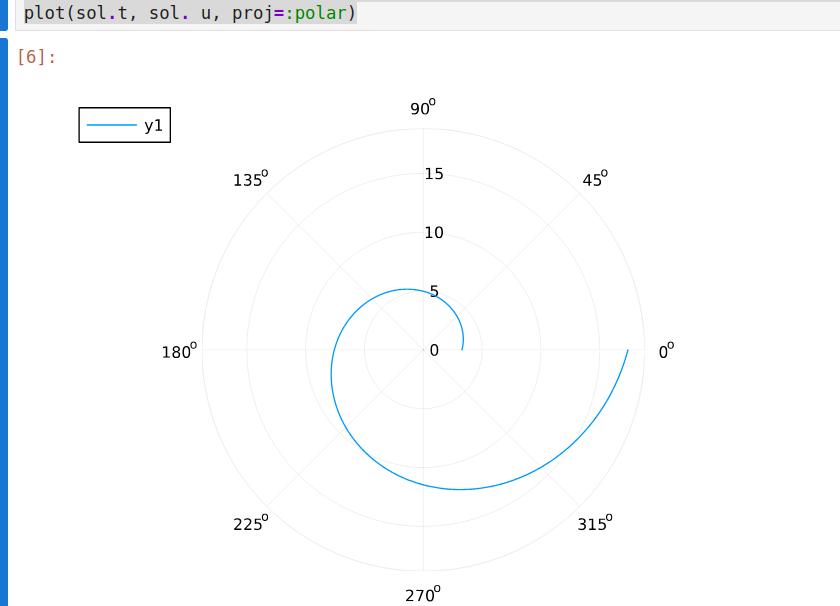
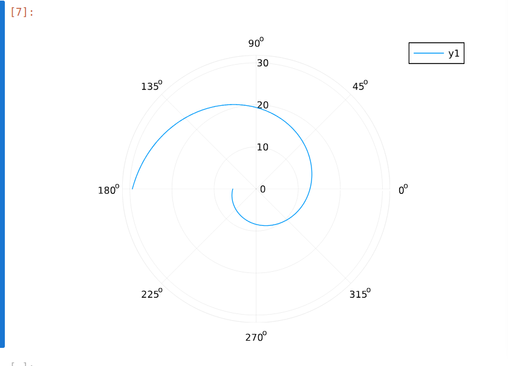

---
## Front matter
title: "Лабораторная работа №2"
subtitle: "Задача о погоне"
author: "Акопян Сатеник"

## Generic otions
lang: ru-RU
toc-title: "Содержание"

## Bibliography
bibliography: bib/cite.bib
csl: pandoc/csl/gost-r-7-0-5-2008-numeric.csl

## Pdf output format
toc: true # Table of contents
toc-depth: 2
lof: true # List of figures
lot: true # List of tables
fontsize: 12pt
linestretch: 1.5
papersize: a4
documentclass: scrreprt
## I18n polyglossia
polyglossia-lang:
  name: russian
  options:
	- spelling=modern
	- babelshorthands=true
polyglossia-otherlangs:
  name: english
## I18n babel
babel-lang: russian
babel-otherlangs: english
## Fonts
mainfont: IBM Plex Serif
romanfont: IBM Plex Serif
sansfont: IBM Plex Sans
monofont: IBM Plex Mono
mathfont: STIX Two Math
mainfontoptions: Ligatures=Common,Ligatures=TeX,Scale=0.94
romanfontoptions: Ligatures=Common,Ligatures=TeX,Scale=0.94
sansfontoptions: Ligatures=Common,Ligatures=TeX,Scale=MatchLowercase,Scale=0.94
monofontoptions: Scale=MatchLowercase,Scale=0.94,FakeStretch=0.9
mathfontoptions:
## Biblatex
biblatex: true
biblio-style: "gost-numeric"
biblatexoptions:
  - parentracker=true
  - backend=biber
  - hyperref=auto
  - language=auto
  - autolang=other*
  - citestyle=gost-numeric
## Pandoc-crossref LaTeX customization
figureTitle: "Рис."
tableTitle: "Таблица"
listingTitle: "Листинг"
lofTitle: "Список иллюстраций"
lotTitle: "Список таблиц"
lolTitle: "Листинги"
## Misc options
indent: true
header-includes:
  - \usepackage{indentfirst}
  - \usepackage{float} # keep figures where there are in the text
  - \floatplacement{figure}{H} # keep figures where there are in the text
---

# Задание

(1132226451%70) + 1 = 42 вариант

На море в тумане катер береговой охраны преследует лодку браконьеров.
Через определенный промежуток времени туман рассеивается, и лодка
обнаруживается на расстоянии 16,1 км от катера. Затем лодка снова скрывается в
тумане и уходит прямолинейно в неизвестном направлении. Известно, что скорость
катера в 3,9 раза больше скорости браконьерской лодки.

1. Запишите уравнение, описывающее движение катера, с начальными
условиями для двух случаев (в зависимости от расположения катера
относительно лодки в начальный момент времени).

2. Постройте траекторию движения катера и лодки для двух случаев.

3. Найдите точку пересечения траектории катера и лодки


# Выполнение лабораторной работы

Запишем уравнение описывающее движение катера, с начальными условиями для двух случаев.

Принимает за $t_0 = 0$ , $x_{л0} = 0$ - место нахождения лодки браконьеров в
момент обнаружения,$x_{k0} = 16.1$ - место нахождения катера береговой охраны
относительно лодки браконьеров в момент обнаружения лодки.

Введем полярные координаты. Считаем, что полюс - это точка обнаружения
лодки браконьеров $$x_{л0} ( {\theta }= x_{л0} = 0)$$ а полярная ось $r$ проходит через точку нахождения катера береговой охраны

Траектория катера должна быть такой, чтобы и катер, и лодка все время
были на одном расстоянии от полюса $\theta$ , только в этом случае траектория катера пересечется с траекторией лодки.

Поэтому для начала катер береговой охраны должен двигаться некоторое
время прямолинейно, пока не окажется на том же расстоянии от полюса, что
и лодка браконьеров. После этого катер береговой охраны должен двигаться
вокруг полюса удаляясь от него с той же скоростью, что и лодка
браконьеров.


Чтобы найти расстояние $x$ (расстояние после которого катер начнет
двигаться вокруг полюса), необходимо составить простое уравнение. Пусть
через время $t$ катер и лодка окажутся на одном расстоянииx от полюса. За
это время лодка пройдет $x$ , а катер $k - x$ (или $k+x$ , в зависимости от
начального положения катера относительно полюса). Время, за которое они
пройдут это расстояние, вычисляется как $x/v$ или $k - x /2v$ (во втором случае
$k + x /2v$)

Так как время одно и то же, то эти величины одинаковы.
Тогда неизвестное расстояниеx можно найти из следующего уравнения:
$$
\dfrac{x}{v} = \dfrac{k-x}{3.9v} \text{ -- в первом случае}
$$
$$
\dfrac{x}{v} = \dfrac{k+x}{3.9v} \text{ -- во втором}
$$

После того, как катер береговой охраны окажется на одном расстоянии от
полюса, что и лодка, он должен сменить прямолинейную траекторию и
начать двигаться вокруг полюса удаляясь от него со скоростью лодки $v$.
Для этого скорость катера раскладываем на две составляющие:$v_r$ -
радиальная скорость и $v_\tau$- тангенциальная скорость. Радиальная
скорость - это скорость, с которой катер удаляется от полюса,$v_r$

Нам
нужно, чтобы эта скорость была равна скорости лодки, поэтому полагаем 
dr / dt = v.
Тангенциальная скорость – это линейная скорость вращения катера
относительно полюса. Она равна произведению угловой скорости 
d /theta /dt на радиус r ,v_r = r d /theta/dt
v r dt

Решение исходной задачи сводится к решению системы из двух
дифференциальных уравнений


$$\begin{cases}
&\dfrac{dr}{dt} = v\\
&r\dfrac{d \theta}{dt} = \sqrt{14.21}v
\end{cases}$$

С начальными условиями для первого случая:

$$\begin{cases}
&{\theta}_0 = 0\\  \tag{1}
&r_0 = \dfrac{16.1}{4.9}
\end{cases}$$

Или для второго:

$$\begin{cases}
&{\theta}_0 = -\pi\\  \tag{2}
&r_0 = \dfrac{16.1}{2.9}
\end{cases}$$


Исключая из полученной системы производную по t, можно перейти к
следующему уравнению:

$$
\dfrac{dr}{d \theta} = \dfrac{r}{\sqrt{14.21}}
$$

Начальные условия остаются прежними. Решив это уравнение, получим
траекторию движения катера в полярных координатах.

```Julia

k = 16.1

r0 = k/4.9
r0_2 = k/2.9

# v^2 = v_r^2 + v_t^2
# v_t = sqrt(15,21v^2 - v^2) = sqrt(14,21)v


theta_0 = (0.0, 2*pi)
theta_02 = (-pi, pi)

fi = 3*pi/4
t = (0, 50)

x(t) = tan(fi)*t
f(r, p, t) = r/sqrt(14.21)

problem = ODEProblem(f, r0, theta_0)
sol = solve(problem, saveat = 0.01)
plot(sol.t, sol. u, proj=:polar)

problem = ODEProblem(f, r0_2, theta_02)
sol = solve(problem, saveat = 0.01)
plot(sol.t, sol. u, proj=:polar)

```
1 случай:



2 случай:


