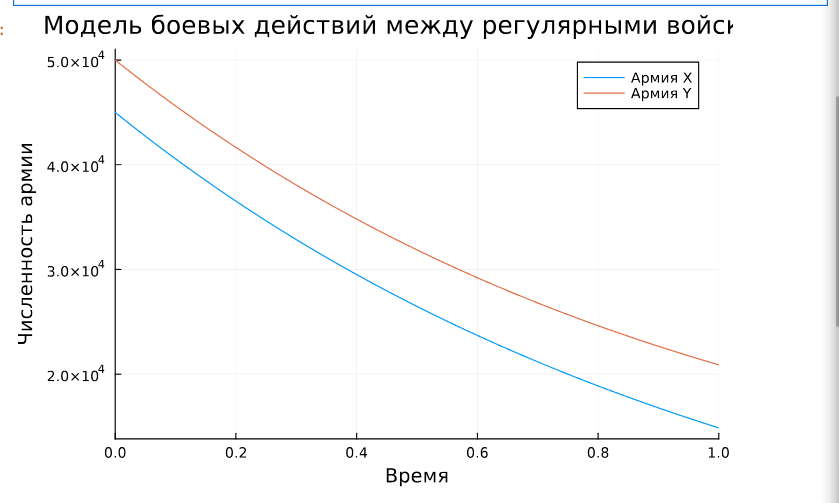
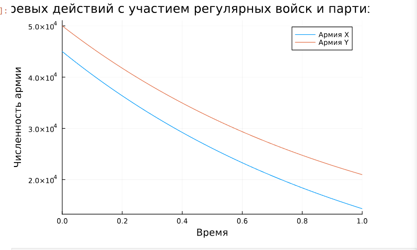

---
## Front matter
lang: ru-RU
title: Лабораторная работа №3
subtitle: Модель боевых действий
author:
  - Акопян Сатеник
institute:
  - Российский университет дружбы народов, Москва, Россия
  # - Объединённый институт ядерных исследований, Дубна, Россия
# date: 01 января 1950

## i18n babel
babel-lang: russian
babel-otherlangs: english

## Formatting pdf
toc: false
toc-title: Содержание
slide_level: 2
aspectratio: 169
section-titles: true
theme: metropolis
header-includes:
 - \metroset{progressbar=frametitle,sectionpage=progressbar,numbering=fraction}
---
## Задание

Между страной $Х$ и страной $У$ идет война. Численность состава войск
исчисляется от начала войны, и являются временными функциями $x(t)$ и $y(t)$. В
начальный момент времени страна $Х$ имеет армию численностью $45 000$ человек, а
в распоряжении страны $У$ армия численностью в $50 000$ человек. Для упрощения
модели считаем, что коэффициенты $a, b, c, h$ постоянны. Также считаем $P(t)$  и $Q(t)$ 
непрерывные функции.

## Задание

Постройте графики изменения численности войск армии Х и армии У для
следующих случаев:

1. Модель боевых действий между регулярными войсками

$$
\dfrac{dx}{dt} = -0.29x(t) - 0.67y(t) + |sin(t) + 1|
$$

$$
\dfrac{dy}{dt} = -0.6x(t) - 0.38y(t) + |cos(t) + 1|
$$

## Задание

2. Модель ведение боевых действий с участием регулярных войск и
партизанских отрядов

$$
\dfrac{dx}{dt} = -0.31x(t) - 0.67y(t) + 2|sin(t)|
$$

$$
\dfrac{dy}{dt} = -0.42x(t) - 0.53y(t) + |cos(t) + 1|
$$


## Теоретическое введение

Рассмотрим некоторые простейшие модели боевых действий – модели
Ланчестера. В противоборстве могут принимать участие как регулярные войска,
так и партизанские отряды. В общем случае главной характеристикой соперников
являются численности сторон. Если в какой-то момент времени одна из
численностей обращается в нуль, то данная сторона считается проигравшей (при
условии, что численность другой стороны в данный момент положительна)


## Выполнение лабораторной работы

В первом случае численность регулярных войск определяется тремя
факторами:

* скорость уменьшения численности войск из-за причин, не связанных с
боевыми действиями (болезни, травмы, дезертирство);

## Выполнение лабораторной работы

* скорость потерь, обусловленных боевыми действиями
противоборствующих сторон (что связанно с качеством стратегии,
уровнем вооружения, профессионализмом солдат и т.п.);

* скорость поступления подкрепления (задаётся некоторой функцией от
времени).

## Выполнение лабораторной работы

В этом случае модель боевых действий между регулярными войсками
описывается следующим образом

$$
\dfrac{dx}{dt} = -0.29x(t) - 0.67y(t) + |sin(t) + 1|
$$

$$
\dfrac{dy}{dt} = -0.6x(t) - 0.38y(t) + |cos(t) + 1|
$$

## Выполнение лабораторной работы

Потери, не связанные с боевыми действиями, описывают члены $-0.29x(t)$ и $- 0.38y(t)$
, члены $- 0.67y(t)$ и $-0.6x(t)$
отражают потери на поле боя.
Коэффициенты $- 0.67$ и $-0.6$ указывают на эффективность боевых действий со
стороны у и х соответственно, $-0.29$ $- 0.38$ - величины, характеризующие степень
влияния различных факторов на потери. Функции  учитывают $|sin(t) + 1|$ и $|cos(t) + 1|$
возможность подхода подкрепления к войскам $Х$ и $У$ в течение одного дня.

## Выполнение лабораторной работы

Программный код для 1 случая выглядит следующим образом:

```Julia
using DifferentialEquations, Plots;

function reg(u, p, t)
    x, y = u
    a, b, c, h = p
    dx = -a*x - b*y+ abs(sin(t) + 1)
    dy = -c*x -h*y+abs(cos(t)+1)
    return [dx, dy]
end
```
## Выполнение лабораторной работы
```Julia

u0 = [45000, 50000]
p = [0.29, 0.67, 0.6, 0.38]
tspan = (0,1)

prob = ODEProblem(reg, u0, tspan, p)

sol = solve(prob, Tsit5())

plot(sol, title = "Модель боевых действий между регулярными войсками",  label = ["Армия X" "Армия Y"], xaxis = "Время", yaxis = "Численность армии")
```
## Выполнение лабораторной работы



## Выполнение лабораторной работы

Во втором случае в борьбу добавляются партизанские отряды. Нерегулярные
войска в отличии от постоянной армии менее уязвимы, так как действуют скрытно,
в этом случае сопернику приходится действовать неизбирательно, по площадям,
занимаемым партизанами. Поэтому считается, что тем потерь партизан,
проводящих свои операции в разных местах на некоторой известной территории,
пропорционален не только численности армейских соединений, но и численности
самих партизан. В результате модель принимает вид:

$$
\dfrac{dx}{dt} = -0.31x(t) - 0.67y(t) + 2|sin(t)|
$$

$$
\dfrac{dy}{dt} = -0.42x(t) - 0.53y(t) + |cos(t) + 1|
$$

## Выполнение лабораторной работы

Программный код для 2 случая выглядит следующим образом:

```Julia
function reg_2(u, p, t)
    x, y = u
    a, b, c, h = p
    dx = -a*x - b*y+ 2*abs(sin(2t))
    dy = -c*x -h*y+abs(cos(t)+1)
    return [dx, dy]
end
```


## Выполнение лабораторной работы
```Julia

u0 = [45000, 50000]
p = [0.31, 0.67, 0.42, 0.53]
tspan = (0,1)

prob = ODEProblem(reg_2, u0, tspan, p)

sol = solve(prob, Tsit5())

plot(sol, title = "Модель боевых действий c участием регулярных войск и партизанских отрядов",  label = ["Армия X" "Армия Y"], xaxis = "Время", yaxis = "Численность армии")
```
## Выполнение лабораторной работы



## Выводы

В результате данной лабораторной работы была построена модель боевых действий на языке прогаммирования Julia.

