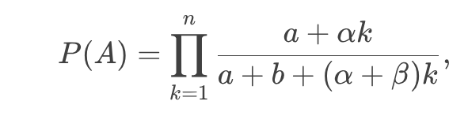

---
## Front matter
lang: ru-RU
title: Доклад
subtitle: Зависимость от пути
author:
  - Акопян Сатеник
institute:
  - Российский университет дружбы народов, Москва, Россия
  - Объединённый институт ядерных исследований, Дубна, Россия
# date: 01 января 1970

## i18n babel
babel-lang: russian
babel-otherlangs: english

## Formatting pdf
toc: false
toc-title: Содержание
slide_level: 2
aspectratio: 169
section-titles: true
theme: metropolis
header-includes:
 - \metroset{progressbar=frametitle,sectionpage=progressbar,numbering=fraction}
---

## Цель работы

Изучение урновых моделей с зависимостью от пути как примера стохастических процессов с памятью.

## Определение и суть концепции

Зависимость от пути (path dependence) — это свойство динамических систем, при котором их текущее состояние и будущее развитие определяются не только текущими условиями, но и всей историей предыдущих изменений.

## Определение и суть концепции

Механизмы закрепления:

* Сетевые эффекты (например, рост ценности технологии по мере увеличения числа пользователей).

* Положительная обратная связь (усиление выбранного пути за счет возрастающей отдачи).

* Институциональная инерция (например, юридические нормы или традиции, сопротивляющиеся изменениям).

## Урновые модели как базовый инструмент

В модели Пойи каждый вынутый шар определённого цвета приводит к добавлению в урну новых шаров того же цвета, что усиливает вероятность его выбора в будущем.

Формализация: Если в начальный момент в урне a шаров цвета A и b шаров цвета B, то вероятность доминирования цвета A к шагу n описывается формулой:

где α,β — коэффициенты усиления для каждого цвета.

## Ключевые механизмы

* Сетевые эффекты:

Пример: Рост социальных сетей (Facebook, Twitter) — ценность платформы растёт с числом пользователей, что подавляет конкуренцию.

* Возрастающая отдача (increasing returns):

Технологии с высокими фиксированными и низкими предельными затратами (например, ПО: разработка дорога, тиражирование дёшево).

* Институциональная инерция:

Пример: Правовая система Польши до сих пор отражает различия между регионами бывшей Австро-Венгерской, Российской и Прусской империй (исследование Stachowiak-Kudła и Kudła, 2022).

## Типы и условия возникновения

1. Первая степень (Weak Path Dependence)

Суть: Исторические события влияют на траекторию развития, но конечный результат остаётся оптимальным.

Пример:

Выбор между двумя технологиями с одинаковой эффективностью. Ранний случайный выбор одной из них создаёт path dependence, но итоговый стандарт не хуже альтернативы.

Ключевой тезис:

"История имеет значение, но не ведёт к неоптимальным исходам".

## Типы и условия возникновения

2. Вторая степень (Semi-Strong Path Dependence)

Суть: Система застревает в субоптимальном равновесии, но переход к более эффективному состоянию возможен, хотя и требует затрат.

Пример:

Энергетика: Зависимость от угля в XIX веке. Переход на газ или ВИЭ возможен, но требует инвестиций и политической воли.

Ключевой тезис:

"Неэффективность существует, но её можно преодолеть через координацию или внешнее вмешательство".

## Типы и условия возникновения

3. Третья степень (Strong Path Dependence)

Суть: Система навсегда заперта в неэффективном состоянии из-за невозможности перехода (высокие издержки, институциональные барьеры).

Критика Liebowitz и Margolis:

Учёные утверждают, что реальных примеров третьей степени нет, так как рынки или общества всегда находят пути коррекции.

## Примеры из разных областей

Технологии:

QWERTY-клавиатура — изначально разработана для замедления скорости печати на механических пишущих машинках, чтобы избежать заклинивания. Несмотря на появление более эргономичных раскладок (Dvorak), QWERTY остаётся стандартом из-за массового распространения и затрат на переобучение.

## Примеры из разных областей

Экономика:

Стандартная железнодорожная колея (1435 мм) — исторически выбрана Джорджем Стефенсоном для угольных шахт. Несмотря на инженерные преимущества более широких колей (например, Brunel gauge), стандарт распространился из-за уже построенной инфраструктуры.

## Примеры из разных областей

Биология:

Эволюция панд — рудиментарный "шестой палец" (видоизменённая кость запястья) — пример эволюционной зависимости от пути, где исторически сложившаяся адаптация сохраняется, даже если не оптимальна.
