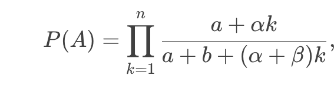

---
## Front matter
title: "Доклад"
subtitle: "Зависимость от пути"
author: "Акопян Сатеник"

## Generic otions
lang: ru-RU
toc-title: "Содержание"

## Bibliography
bibliography: bib/cite.bib
csl: pandoc/csl/gost-r-7-0-5-2008-numeric.csl

## Pdf output format
toc: true # Table of contents
toc-depth: 2
lof: true # List of figures
lot: true # List of tables
fontsize: 12pt
linestretch: 1.5
papersize: a4
documentclass: scrreprt
## I18n polyglossia
polyglossia-lang:
  name: russian
  options:
	- spelling=modern
	- babelshorthands=true
polyglossia-otherlangs:
  name: english
## I18n babel
babel-lang: russian
babel-otherlangs: english
## Fonts
mainfont: IBM Plex Serif
romanfont: IBM Plex Serif
sansfont: IBM Plex Sans
monofont: IBM Plex Mono
mathfont: STIX Two Math
mainfontoptions: Ligatures=Common,Ligatures=TeX,Scale=0.94
romanfontoptions: Ligatures=Common,Ligatures=TeX,Scale=0.94
sansfontoptions: Ligatures=Common,Ligatures=TeX,Scale=MatchLowercase,Scale=0.94
monofontoptions: Scale=MatchLowercase,Scale=0.94,FakeStretch=0.9
mathfontoptions:
## Biblatex
biblatex: true
biblio-style: "gost-numeric"
biblatexoptions:
  - parentracker=true
  - backend=biber
  - hyperref=auto
  - language=auto
  - autolang=other*
  - citestyle=gost-numeric
## Pandoc-crossref LaTeX customization
figureTitle: "Рис."
tableTitle: "Таблица"
listingTitle: "Листинг"
lofTitle: "Список иллюстраций"
lotTitle: "Список таблиц"
lolTitle: "Листинги"
## Misc options
indent: true
header-includes:
  - \usepackage{indentfirst}
  - \usepackage{float} # keep figures where there are in the text
  - \floatplacement{figure}{H} # keep figures where there are in the text
---

# Цель работы

Изучение урновых моделей с зависимостью от пути как примера стохастических процессов с памятью.

# Основная часть

**Определение и суть концепции**

Зависимость от пути (path dependence) — это свойство динамических систем, при котором их текущее состояние и будущее развитие определяются не только текущими условиями, но и всей историей предыдущих изменений.

Ключевой принцип: Случайные события или ранние решения могут "закрепляться" в системе, создавая долгосрочные последствия, которые сложно изменить даже при наличии более эффективных альтернатив.

Механизмы закрепления:

* Сетевые эффекты (например, рост ценности технологии по мере увеличения числа пользователей).

* Положительная обратная связь (усиление выбранного пути за счет возрастающей отдачи).

* Институциональная инерция (например, юридические нормы или традиции, сопротивляющиеся изменениям).

**Урновые модели как базовый инструмент**

В модели Пойи каждый вынутый шар определённого цвета приводит к добавлению в урну новых шаров того же цвета, что усиливает вероятность его выбора в будущем.

Формализация: Если в начальный момент в урне a шаров цвета A и b шаров цвета B, то вероятность доминирования цвета A к шагу n описывается формулой:

где α,β — коэффициенты усиления для каждого цвета.

Неэргодические процессы: Системы, где средние по времени не совпадают с ансамблевыми средними (например, модели с гистерезисом).

Изучение механизмов "закрепления" траекторий:

Сетевые эффекты:

Пример: Рост социальных сетей (Facebook, Twitter) — ценность платформы растёт с числом пользователей, что подавляет конкуренцию.

Возрастающая отдача (increasing returns):

Технологии с высокими фиксированными и низкими предельными затратами (например, ПО: разработка дорога, тиражирование дёшево).

Институциональная инерция:

Пример: Правовая система Польши до сих пор отражает различия между регионами бывшей Австро-Венгерской, Российской и Прусской империй (исследование Stachowiak-Kudła и Kudła, 2022).

Критика концепции:

Спорные случаи:

QWERTY vs. Dvorak:

Аргумент "неэффективности": Исследования Пола Дэвида (1985) утверждают, что QWERTY — пример субоптимального стандарта.

Контраргументы Liebowitz и Margolis: Эмпирические данные показывают, что разница в скорости печати между раскладками незначительна, а переходные издержки перевешивают гипотетические выгоды.

VHS vs. Betamax:

Дебаты о том, была ли победа VHS следствием зависимости от пути или адаптации к рыночным запросам (длительность записи).

Теоретические ограничения:

Многие модели path dependence предполагают идеализированные условия (бесконечное время, отсутствие внешних шоков), что редко выполняется в реальности.

**Типы и условия возникновения**

Экономисты С.Дж. Липовиц и Д. Марголис предложили разделять зависимость от пути на три степени, чтобы отделить случаи, где неэффективность реальна, от ситуаций, где концепция используется некорректно.

1. Первая степень (Weak Path Dependence)

Суть: Исторические события влияют на траекторию развития, но конечный результат остаётся оптимальным.

Пример:

Выбор между двумя технологиями с одинаковой эффективностью. Ранний случайный выбор одной из них создаёт path dependence, но итоговый стандарт не хуже альтернативы.

Ключевой тезис:

"История имеет значение, но не ведёт к неоптимальным исходам".

2. Вторая степень (Semi-Strong Path Dependence)

Суть: Система застревает в субоптимальном равновесии, но переход к более эффективному состоянию возможен, хотя и требует затрат.

Пример:

Энергетика: Зависимость от угля в XIX веке. Переход на газ или ВИЭ возможен, но требует инвестиций и политической воли.

Ключевой тезис:

"Неэффективность существует, но её можно преодолеть через координацию или внешнее вмешательство".

3. Третья степень (Strong Path Dependence)

Суть: Система навсегда заперта в неэффективном состоянии из-за невозможности перехода (высокие издержки, институциональные барьеры).

Критика Liebowitz и Margolis:

Учёные утверждают, что реальных примеров третьей степени нет, так как рынки или общества всегда находят пути коррекции.

**Примеры из разных областей**

Технологии:

QWERTY-клавиатура — изначально разработана для замедления скорости печати на механических пишущих машинках, чтобы избежать заклинивания. Несмотря на появление более эргономичных раскладок (Dvorak), QWERTY остаётся стандартом из-за массового распространения и затрат на переобучение.

VHS vs. Betamax: Победа VHS в "войне форматов" связана не с техническим превосходством, а с стратегией лицензирования, поддержкой порноиндустрии и сетевыми эффектами (больше доступного контента).

Экономика:

Стандартная железнодорожная колея (1435 мм) — исторически выбрана Джорджем Стефенсоном для угольных шахт. Несмотря на инженерные преимущества более широких колей (например, Brunel gauge), стандарт распространился из-за уже построенной инфраструктуры.

Биология:

Эволюция панд — рудиментарный "шестой палец" (видоизменённая кость запястья) — пример эволюционной зависимости от пути, где исторически сложившаяся адаптация сохраняется, даже если не оптимальна.

**Условия для возникновения зависимости от пути**

Для появления path dependence необходимы специфические условия, которые делают систему чувствительной к начальным условиям и истории:

Долговечность капитала (Durability of Capital)

Суть: Высокие первоначальные инвестиции в инфраструктуру или технологии создают "якорь", который трудно сдвинуть.

Пример:

Железнодорожная колея: Переход с колеи 1435 мм на более широкую (например, русскую 1520 мм) требует замены путей, вагонов и станций, что экономически нецелесообразно.

Динамическая возрастающая отдача (Dynamic Increasing Returns)

Суть: Чем больше агентов выбирают определённый путь, тем выше выгода для следующих участников.

Пример:

Кластеры в IT (Силиконовая долина): Чем больше компаний базируется в регионе, тем легче новым стартапам находить инвесторов, сотрудников и партнёров.

Техническая взаимосвязанность (Technical Interrelatedness)

Суть: Компоненты системы настолько связаны, что изменение одного элемента требует перестройки всей системы.

Пример:

Legacy-системы в банках: Устаревшее ПО для обработки транзакций работает на специфическом "стеке" технологий. Переход на современные системы требует полной перепроектировки архитектуры.

Институциональная инерция (Institutional Lock-In)

Суть: Нормы, законы или традиции блокируют изменения.

Пример:

Правовые системы: В Польше суды в регионах бывшей Австро-Венгрии чаще апеллируют к принципу справедливости, а в бывшей Пруссии — к букве закона, из-за исторически сложившихся традиций.

# Выводы

Здесь кратко описываются итоги проделанной работы.
